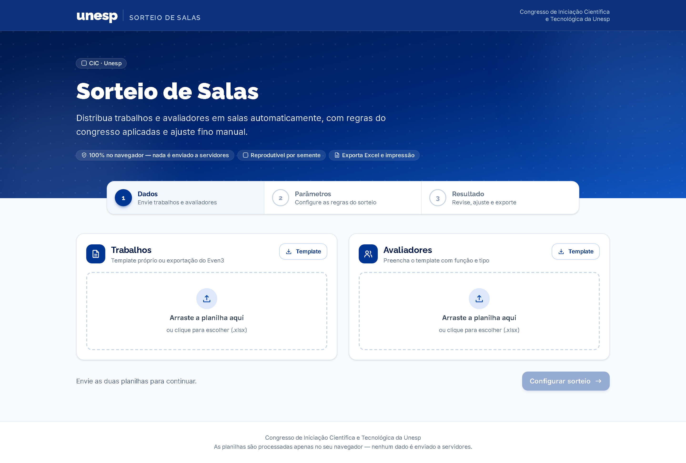
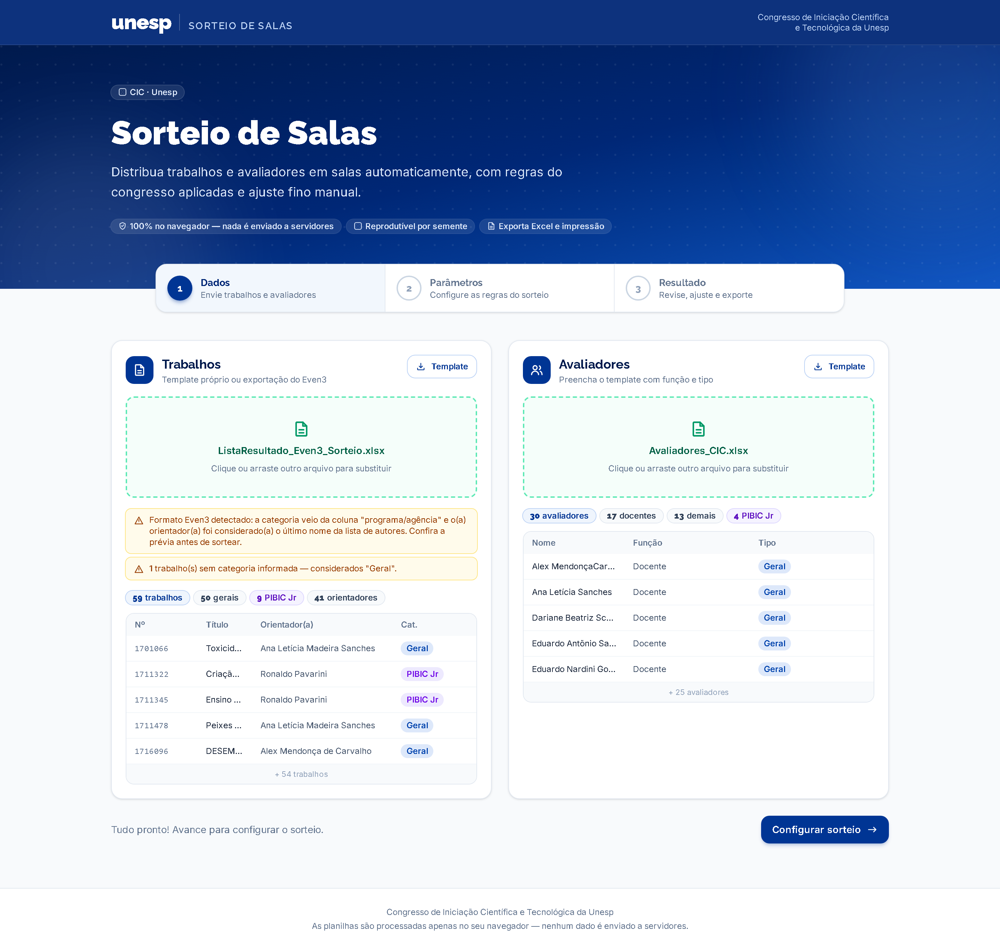
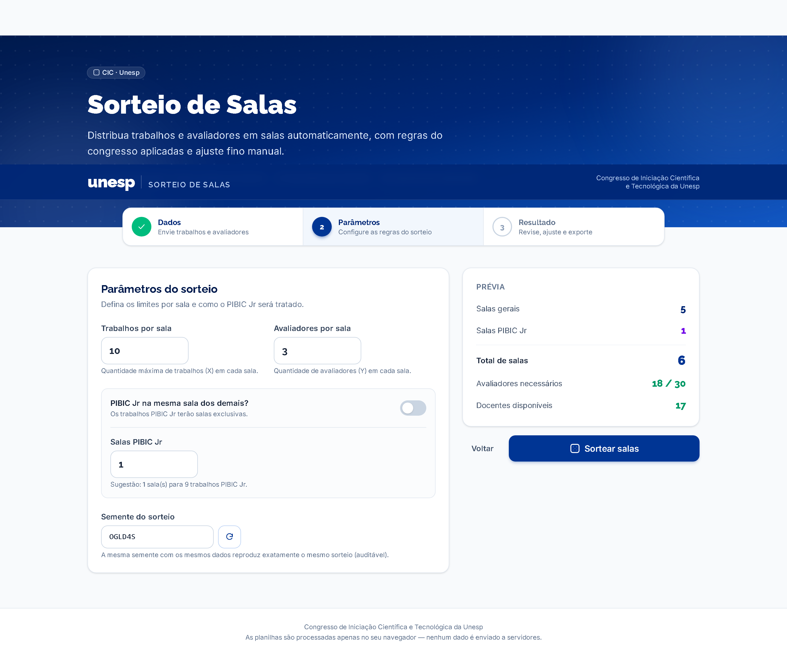
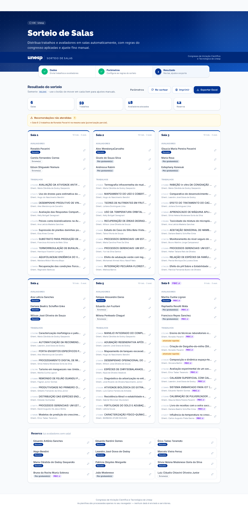
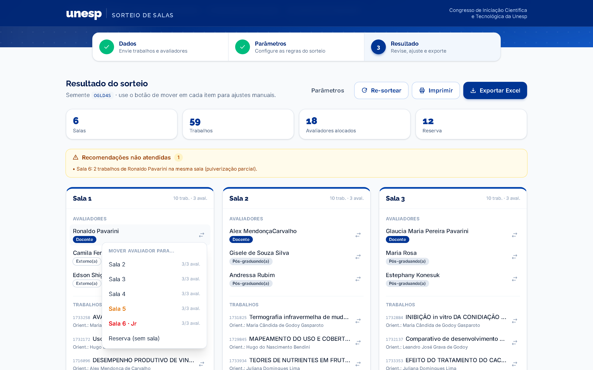
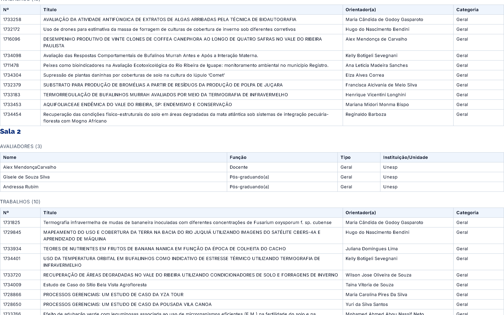

# Tutorial de uso — Sorteio de Salas · CIC Unesp

Este tutorial ensina, passo a passo, como usar a plataforma para distribuir trabalhos e
avaliadores em salas do Congresso de Iniciação Científica e Tecnológica da Unesp.

**Acesso:** https://chiavinik.github.io/sorteio-salas-cic/ — funciona direto no navegador,
sem instalação e sem cadastro. **Nenhum dado sai do seu computador.**

---

## Antes de começar

Você vai precisar de **duas planilhas**:

| Planilha | Formatos aceitos |
| --- | --- |
| **Trabalhos** | Template do app **ou** a exportação do Even3 (ListaResultado), sem nenhuma alteração |
| **Avaliadores** | Template do app |

A tela inicial mostra as três etapas do processo: **Dados → Parâmetros → Resultado**.

---

## Etapa 1 — Enviar os dados

### 1.1 Baixar os templates

Em cada cartão (Trabalhos e Avaliadores), clique no botão **Template** para baixar a
planilha modelo. Cada arquivo tem uma aba **Instruções** com o significado de cada coluna.

### 1.2 Preencher as planilhas

**Trabalhos** (uma linha por trabalho):

| Coluna | Como preencher |
| --- | --- |
| Número | Identificador do trabalho (ex.: número de submissão) |
| Título | Título completo |
| Categoria | `Geral` ou `PIBIC Jr` |
| Área temática | Opcional |
| Apresentador(es) | Separados por ponto e vírgula (;) |
| Autores | Todos os autores, separados por ponto e vírgula (;) |
| Orientador(a) | Nome do(a) orientador(a) **oficial** — impede que avalie a própria sala |
| E-mail do(a) orientador(a) | Opcional, melhora a detecção de conflitos |

> 💡 **Atalho:** se você tem a exportação do Even3, não precisa preencher nada — envie o
> arquivo direto. O app detecta o formato, deriva a categoria da coluna "programa/agência"
> e considera o(a) orientador(a) como o último nome da lista de autores (confira na prévia!).

**Avaliadores** (uma linha por avaliador):

| Coluna | Como preencher |
| --- | --- |
| Nome | Nome completo (de preferência igual ao usado nos trabalhos) |
| E-mail | Opcional, melhora a detecção de conflitos |
| Função | `Docente`, `Pós-graduando` ou `Externo` — o sorteio garante 1 docente por sala |
| Tipo | `Geral` ou `PIBIC Jr` — PIBIC Jr tem prioridade nas salas PIBIC Jr |
| Instituição/Unidade | Opcional |

### 1.3 Importar e conferir

Arraste cada arquivo para a área tracejada correspondente (ou clique para escolher). O app
mostra imediatamente:

- **Etiquetas de resumo** — totais por categoria, função e tipo;
- **Alertas amarelos** — pontos que merecem conferência (ex.: trabalho sem categoria);
- **Prévia** — primeiras linhas interpretadas.

Confira se os totais fazem sentido e clique em **Configurar sorteio**.

---

## Etapa 2 — Configurar o sorteio

| Parâmetro | O que significa |
| --- | --- |
| **Trabalhos por sala (X)** | Máximo de trabalhos que cada sala comporta |
| **Avaliadores por sala (Y)** | Quantos avaliadores cada sala deve receber |
| **PIBIC Jr na mesma sala dos demais?** | Desligado (padrão): salas exclusivas para PIBIC Jr. Ligado: tudo misturado |
| **Salas PIBIC Jr** | Quantidade de salas exclusivas (o app sugere o mínimo necessário) |
| **Semente do sorteio** | Código que torna o sorteio reprodutível (veja abaixo) |

> 🎲 **O que é a semente?** É um código curto (ex.: `OGLD4S`) que "trava" a aleatoriedade:
> com os mesmos arquivos, os mesmos parâmetros e a mesma semente, o sorteio produz
> **exatamente o mesmo resultado** — em qualquer computador. Anote a semente usada no evento
> para poder auditar ou reproduzir o sorteio depois. O botão ao lado gera uma nova semente.

O painel **Prévia** à direita mostra o dimensionamento calculado (salas gerais e PIBIC Jr,
avaliadores necessários × disponíveis, docentes) e exibe alertas caso algo não feche — por
exemplo, docentes insuficientes para o número de salas.

Quando estiver tudo certo, clique em **Sortear salas**.

---

## Etapa 3 — Revisar, ajustar e exportar

### 3.1 Entender o resultado

- **Cartões de estatísticas:** salas criadas, trabalhos alocados, avaliadores usados e reserva;
- **Painel de pendências**, em três níveis:
  - 🔴 **Conflitos** — violações de regra rígida (ex.: sala sem docente). Exigem atenção;
  - 🟡 **Recomendações não atendidas** — situações inevitáveis ou toleráveis (ex.: dois
    trabalhos do mesmo orientador na mesma sala quando não há salas suficientes);
  - ⚪ **Informações** — observações neutras;
- **Cartões de sala:** avaliadores (com etiquetas de função e tipo) e trabalhos (com número,
  orientador e categoria). Etiquetas coloridas indicam qualquer situação relevante, como
  `orientador repetido` ou `coautor`.

### 3.2 Ajustes manuais

Cada trabalho e cada avaliador tem um **botão de mover** (setas ⇄) que abre a lista de
destinos possíveis:

- Destinos em **vermelho** criariam um conflito rígido (orientador avaliando a própria sala);
- Destinos em **âmbar** violariam uma recomendação (sala cheia, orientador repetido, coautoria);
- A cada movimento, **todas as validações são recalculadas** e o painel de pendências é
  atualizado na hora;
- Avaliadores também podem ser enviados para a **Reserva** (ou trazidos dela para uma sala).

> ✅ Você tem a palavra final: o app permite qualquer movimento, mas nunca deixa um conflito
> passar despercebido.

### 3.3 Re-sortear

Não gostou da distribuição? O botão **Re-sortear** gera uma nova semente e refaz tudo.
Para repetir um sorteio específico, volte em **Parâmetros** e informe a semente desejada.

### 3.4 Exportar

| Botão | O que gera |
| --- | --- |
| **Exportar Excel** | Arquivo `Resultado_Sorteio_CIC.xlsx` com três abas: Resumo (visão geral por sala), Trabalhos por sala e Avaliadores por sala (incluindo a reserva) |
| **Imprimir** | Versão de impressão com **uma sala por página** (avaliadores + trabalhos), ideal para fixar nas portas das salas. Na janela de impressão, escolha "Salvar como PDF" para gerar um arquivo |

---

## Perguntas frequentes

**Os dados ficam salvos em algum lugar?**
Não. Tudo é processado na memória do navegador. Ao recarregar a página, envie as planilhas
novamente. Nenhuma informação é transmitida pela internet.

**O nome do avaliador está abreviado e diferente do nome nos trabalhos. Funciona?**
Sim, na maioria dos casos: o app reconhece abreviações como "Hugo Bendini" ≈
"Hugo do Nascimento Bendini". Para garantir 100% de precisão, preencha o e-mail do
orientador no template de trabalhos e o e-mail do avaliador no template de avaliadores.

**Apareceu "2 trabalhos do mesmo orientador na mesma sala". É um erro?**
É uma recomendação não atendida. Se o orientador tem mais trabalhos do que existem salas
disponíveis na categoria, a repetição é matematicamente inevitável — o app avisa em vez de
esconder. Você pode aumentar o número de salas ou aceitar a repetição.

**Faltaram avaliadores ou docentes. O que fazer?**
A prévia da Etapa 2 avisa antes do sorteio. As opções são: reduzir avaliadores por sala (Y),
aumentar trabalhos por sala (X, criando menos salas) ou incluir mais avaliadores na planilha.

**Posso usar em outro congresso/câmpus?**
Sim — basta preencher os templates. As regras (X, Y, PIBIC Jr) são configuráveis a cada uso.

---

## Suporte

Dúvidas, problemas ou sugestões: abra uma *issue* em
https://github.com/ChiaviniK/sorteio-salas-cic/issues.

**Desenvolvedor responsável:** Luiz Cláudio Chiavini Oliveira Júnior
